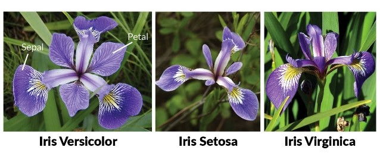

## Iris KNN(k - Nearest Neighbors)

# Iris Dataset
Iris flower dataset has 3 species:
- Setosa
- Versicolor
- Virginica

The iris dataset consists of 4 features:
- Sepal Length
- Sepal Width
- Petal Length
- Petal Width

# KNN

KNN falls in the **supervised learning** family of algorithms. That means if we are given a labelled dataset of consisting of training observations (**_x_**, **_y_**) and would like to capture the relationship between **_x_** and **_y_** by having a function **_f : X -> Y_**, so that a given test dataset **_x_**, **_f(x)_** can predict the corressponding output **_y_**.

For any new data point, the distance to all other data points is calculated and the class is decided based on K nearest neighbors.
An object is classified by a majority vote of its neighbors, with the object being assigned to the class most common among its k nearest neighbors. If k=1 then the object is simply assigned to the class of the single nearest neighbor.

## Objective: To train the KNN algorithm to be able to distinguish the species from one another given the measurements of the four feature
